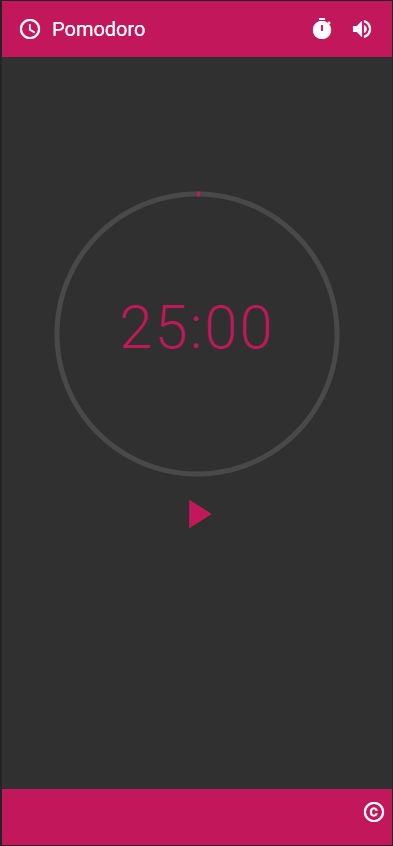
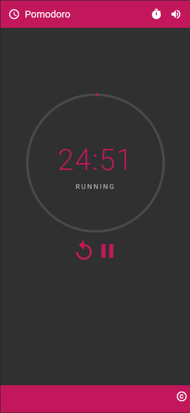

<h1 align="center">
  <g-emoji class="g-emoji" alias="tomato" fallback-src="https://github.githubassets.com/images/icons/emoji/unicode/1f345.png">🍅</g-emoji> ANGULAR POMODORO
</h1>
 
 
    
    
 

<h3 align="center">  
  <a href="#information_source-sobre">Sobre</a> |
  <a href="#rocket-tecnologias">Tecnologias</a> |  
  <a href="#gear-ferramentas">Ferramentas</a> |
  <a href="#licença">Licença</a> 
</h3>

## :information_source: Sobre

Projeto de um temporizador Pomodoro em Angular  
Pomodoro timer project built with Angular 

## :rocket: Tecnologias

HTML 
CSS 
Typescript 

## :gear: Ferramentas

- Angular 9 
- Material Design

## Executando 

npm install
npm start

## Licença
Esse projeto está sob a licença MIT.
